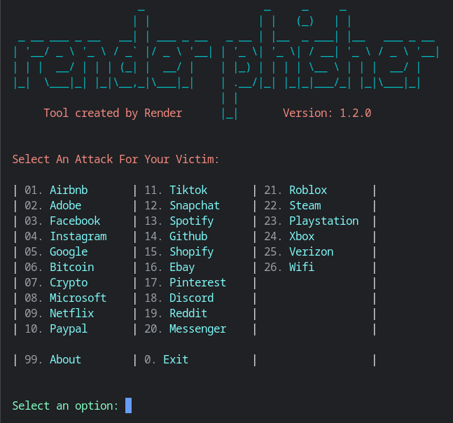

<!-- render.phisher -->

<h1 align="left">render.phisher</h1>

<p align="left">
  <a href="https://github.com/render437/render.phisher">
    </a>
  <a href="https://github.com/render437/render.phisher/blob/main/LICENSE">
    </a>
  <a href="https://github.com/render437/render.phisher/stargazers">
    </a>
   <a href="https://github.com/render437/render.phisher/issues">
    </a>
   <a href="https://github.com/render437/render.phisher/network/members">
    </a>
   <a href="https://github.com/render437/render.phisher/pulls">
     </a>
</p>

<p align="left">
  
  
  
  
</p>


<p align="left"><b>A beginner friendly, simple automated phishing tool with 25+ templates.</b></p>

---

<h3 style="text-align:center;">Disclaimer</h3>

*Any actions and or activities related to <b>render.phisher</b> is solely your responsibility. The misuse of this toolkit can result in **criminal charges** brought against the persons in question. **The contributors will not be held responsible** in the event any criminal charges be brought against any individuals misusing this toolkit to break the law.*

***This toolkit contains materials that can be potentially damaging or dangerous for social media**. Refer to the laws in your province/country before accessing, using,or in any other way utilizing this in a wrong way.*
    
*This tool is provided strictly for educational and research purposes to demonstrate how phishing works and what it is. Do not use any information, code, or techniques contained here to attempt unauthorized access to someone else’s accounts or systems — **doing so is illegal**. Use this toolkit at your own risk.*

*Do not attempt to violate the law with anything contained here. **If this is your intention, then get the fuck out of here**!*

*If you are unsure about the legality of an action, seek professional legal advice before proceeding. **You shall not misuse the information to gain unauthorized access to someones social media**.*
  
*This project is for educational, penetration-testing, or phishing-simulation purposes only.*
- *Only demonstrates how phishing works, **Not for malicious use.***

---

### Features

- Latest and updated login pages.
- Beginner friendly
- Multiple tunneling options
  - Localhost
  - Cloudflared
- Mask URL support(might not work)
- Docker support

---

### Available Links

| Website     | Status                         | Website     | Status                          |
|-------------|--------------------------------|-------------|---------------------------------|
| **Adobe**       | Working                        | **Github**      | Working                          |
| **Airbnb**      | Working                        | **Shopify**     | Working (won't grab username)    |
| **Facebook**    | Working                        | **Ebay**        | Working                          |
| **Instagram**   | Working                        | **Pinterest**   | Working                          |
| **Google**      | Working                        | **Discord**     | Working                          |
| **Bitcoin**     | Working                        | **Reddit**      | Working                          |
| **Crypto**      | Working                        | **Messenger**   | Working (needs new html file)    |
| **Microsoft**   | Working                        | **Roblox**      | Working                          |
| **Netflix**     | Working                        | **Steam**       | Working                          |
| **Paypal**      | Working                        | **Playstation** | Working                          |
| **Tiktok**      | Working                        | **Xbox**        | Working                          |
| **Snapchat**    | Working                        | **Verizon**     | Broken                           |
| **Spotify**     | Working                        | **Wifi**        | Working                          |

***- More to be added in the future!***

---

### Installation

- Just, clone this repository -
  ```
  git clone --depth=1 https://github.com/render437/render.phisher.git
  ```

- Now go to cloned directory and run `render.phisher.sh` -
  ```
  $ cd render.phisher
  $ bash render.phisher.sh
  ```

- On first launch, it'll install the dependencies automatically. That's it, ***render.phisher*** is installed!

---

### All-In-One Command
  ```
  git clone --depth=1 https://github.com/render437/render.phisher.git; cd render.phisher; bash render.phisher.sh
  ```

---

### Installation (Termux)
You can easily install render.phisher in Termux by using tur-repo
```
$ pkg install tur-repo
$ pkg install render.phisher
$ render.phisher
```

---

### Installation via ".deb" file

- Download `.deb` files from the [**Latest Release**](https://github.com/render437/render.phisher/releases/latest)
- If you are using ***termux*** then download the `*_termux.deb`

- Install the `.deb` file by executing
  ```
  apt install YOUR/PATH/TO/DEB/FILE
  ```
  Or
  ```
  $ dpkg -i YOUR/PATH/TO/DEB/FILE
  $ apt install -f
  ```

---

### Uninstall Process

- Just paste this command into your terminal -
  ```
  cd; sudo rm -r render.phisher
  ```

---

### Run on Docker

- Docker Image Mirror:
  - **DockerHub** : 
    ```
    docker pull render437/render.phisher
    ```
  - **GHCR** : 
    ```
    docker pull ghcr.io/render437/render.phisher:latest
    ```

- By using the wrapper script [**run-docker.sh**](https://github.com/render437/render.phisher/blob/main/run-docker.sh)

  ```
  $ curl -LO https://raw.githubusercontent.com/render437/render.phisher/master/run-docker.sh
  $ bash run-docker.sh
  ```
- Temporary Container

  ```
  docker run --rm -ti render437/render.phisher
  ```
  - Remember to mount the `auth` directory.

---

  <summary><h3>Dependencies</h3></summary>

<b>render.phisher</b> requires following programs to run properly - 
- `git`
- `curl`
- `php`
> All the dependencies will be installed automatically when you run **render.phisher** for the first time.
</details>

  <summary><h3>Tested on</h3></summary>

- **Ubuntu**
- **Debian**
- **Arch**
- **Manjaro**
- **Fedora**
- **Termux**
</details>

---

<h3 align="center"><i> Workflow </i></h3>
<p align="center">
  
</p>

---

### Collaborators

Thanks to these amazing people for helping me build and improve this project!


| Collaborator | Contribution |
|-------------|--------------|
| [xroche](https://github.com/xroche) | Set up Cryptocurrency HTML website |
| [Aditya Shakya](https://github.com/adi1090x) | UI/UX design and styling |
| [htr-tech](https://github.com/htr-tech) | Helped set up Cloudflare infrastructure and Paypal HTML Website|
| [Ali Milani](https://github.com/AliMilani) | Discord and Instagram HTML and Image Hosting |
| [KasRoudra](https://github.com/KasRoudra) | Implemented and configured Facebook OAuth login methods |
| [TripleHat](https://github.com/TripleHat) | Configured Web Application Exploitation |
| [Mr.Derek](https://github.com/E343IO) | Developed Link Shortener Infrastructure |

---

### Find Me on:
<p align="left">
  <a href="https://beacons.ai/render437" target="_blank">
  
</a>
  <a href="https://github.com/render437" target="_blank"></a>
</p>


<!-- // -->
